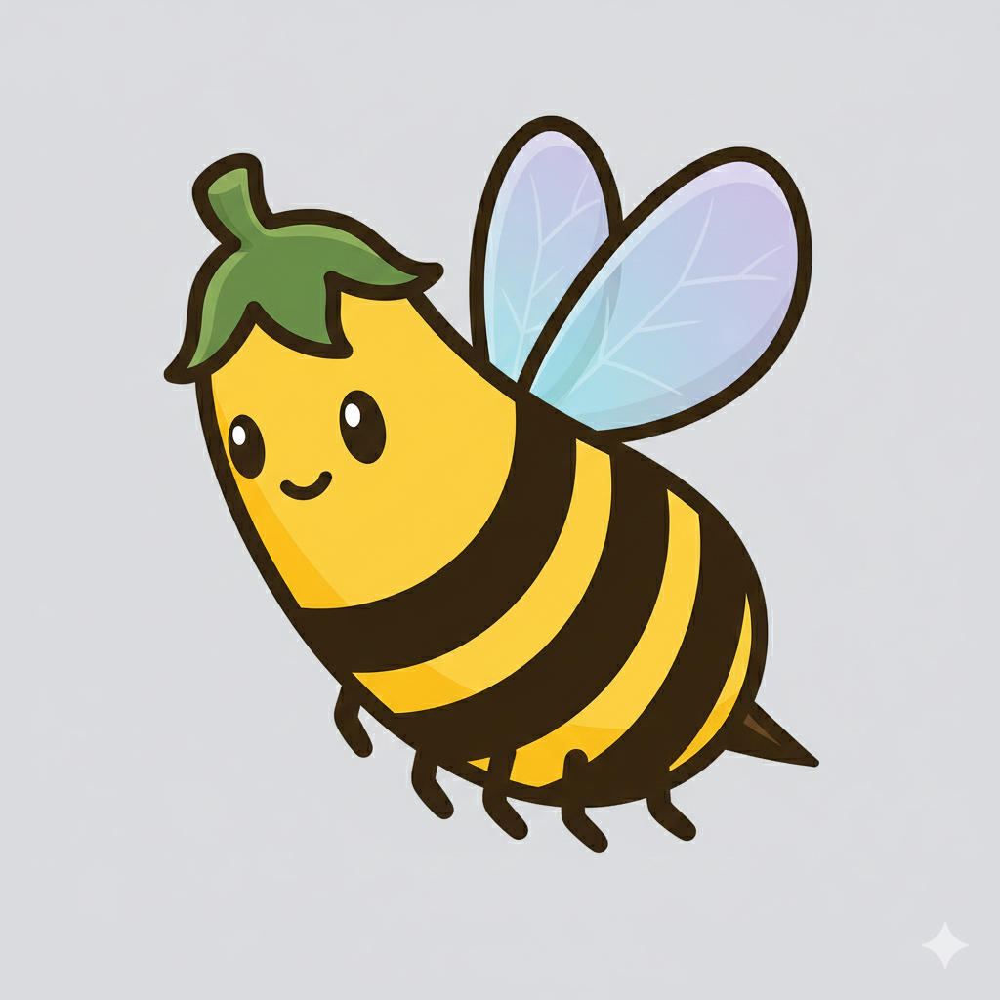

<p align="center">
  
</p>

<h1 align="center">Hive</h1>

<p align="center">
  <strong>Let Your Bees Do the Work! 🍯</strong>
</p>

<p align="center">
  Launch autonomous Claude agents that buzz through your PRDs while you sip coffee.
</p>

<p align="center">
  <a href="https://opensource.org/licenses/MIT"></a>
  <a href="https://github.com/mbourmaud/hive/releases"></a>
</p>

---

## 📦 Install

```bash
curl -fsSL https://raw.githubusercontent.com/mbourmaud/hive/main/install.sh | bash
```

---

## 🐝 How to Bee Productive

| Step | Command |
|------|---------|
| **1. Initialize Your Hive** | `hive init` |
| **2. Create a PRD** <sup>`IN CLAUDE CODE`</sup> | `/hive:prd` |
| **3. Launch Your Drones!** <sup>`IN CLAUDE CODE`</sup> | `/hive:start` |
| **4. Be the Queen** <sup>`IN CLAUDE CODE`</sup> | `/hive:status` |
| **5. Harvest the Honey!** | Review, PR, merge 🍯 |

---

## 📊 Statusline - Track Your Drones

Run `/hive:statusline` in Claude Code to enable drone tracking in your statusline:

```
project │ main │ Opus 4.5 │ 45% │ ⬢ 22
👑 Hive v1.2.0 | 🐝 security (4/10) | 🐝 ui-refactor ✓
```

See all your drones at a glance:
- **🐝 name (X/Y)** - Drone in progress (X stories done out of Y)
- **🐝 name ✓** - Drone completed all stories
- **🔄** - Drone currently running

---

## 🎯 Commands

| In Claude Code | CLI | What it does |
|----------------|-----|--------------|
| `/hive:init` | `hive init` | Set up the hive in your project |
| `/hive:prd` | - | Generate a PRD from description |
| `/hive:start` | `hive start --prd <file>` | Launch a drone |
| `/hive:status` | `hive monitor` | TUI dashboard for all drones |
| `/hive:logs` | `hive logs <name>` | View drone activity |
| `/hive:stop` | `hive stop <name>` | Stop a running drone |
| `/hive:clean` | `hive clean <name>` | Remove drone & worktree |
| `/hive:statusline` | - | Configure statusline |

---

## 🔔 Desktop Notifications

Get notified when drones start, complete, or pause:

| Event | Notification |
|-------|--------------|
| 🐝 Started | "security: 10 stories" |
| 🎉 Completed | "security: 10/10 done!" |
| ⏸️ Paused | "security: 7/10 (max iterations)" |

Works on macOS, Linux, and Windows/WSL.

---

## 🏗️ How It Works

```
┌──────────────────────────────────────────────────────┐
│  👑 Queen (your main branch)                         │
│  You + Claude working on features                    │
│  .hive/ folder with shared state                     │
├──────────────────────────────────────────────────────┤
│  🐝 Drone: security                                  │
│  Branch: hive/security                               │
│  Implementing SEC-001 → SEC-010 autonomously         │
├──────────────────────────────────────────────────────┤
│  🐝 Drone: ui-refactor                               │
│  Branch: hive/ui-refactor                            │
│  Implementing UI-001 → UI-025 autonomously           │
└──────────────────────────────────────────────────────┘
```

Each drone:
- Gets its own **git worktree** (isolated workspace) in `~/.hive/worktrees/<project>/<drone>/`
- Works on its own **branch** (`hive/<name>`)
- **Commits** each story: `feat(SEC-001): description`
- Updates **status.json** in real-time
- Shares `.hive/` state with main project via symlink

---

## 📁 File Structure

```
your-project/                        # 👑 Queen
├── .hive/                           # Shared state
│   ├── prds/                        # Your PRD files
│   │   └── prd-security.json
│   └── drones/                      # Drone status
│       └── security/
│           ├── status.json          # Progress: 4/10
│           ├── activity.log         # What it's doing
│           ├── blocked.md           # Blocking info (if blocked)
│           └── logs/                # Detailed execution logs
│               ├── SEC-001/
│               │   ├── attempt-1.log
│               │   ├── attempt-1-metadata.json
│               │   └── attempt-2.log
│               └── SEC-002/
│                   └── attempt-1.log

~/.hive/worktrees/                   # Global worktree base
└── your-project/                    # Per-project directory
    └── security/                    # 🐝 Drone worktree
        ├── .hive -> /path/to/your-project/.hive  # Symlinked!
        └── (your code being modified)
```

---

## 📊 Comprehensive Logging

Hive now captures detailed execution logs for every Claude invocation:

**Story-specific logs** - Each story gets its own directory:
```
.hive/drones/security/logs/SEC-001/
  ├── attempt-1.log              # Complete Claude output
  ├── attempt-1-metadata.json    # Duration, exit code, timestamps
  └── attempt-2.log              # Retry attempts (if needed)
```

**Metadata tracking** - Every attempt includes:
- Start and end timestamps
- Duration in seconds
- Exit code (success/failure)
- Model used
- Iteration number

**View in TUI**:
```bash
hive monitor
# Select drone → View logs, stop, clean
```

---

## 🚫 Human-in-the-Loop Blocking

Drones automatically block when they encounter repeated errors, preventing wasted resources:

**Automatic blocking** - After 3+ failed attempts on the same story:
- Drone sets status to `blocked`
- Creates `blocked.md` with context and questions
- Sends desktop notification
- Stops execution

**Unblock workflow**:
```bash
hive unblock <drone-name>
# 1. Shows blocked.md with context
# 2. Offers to edit PRD
# 3. Prompts to resume

# OR resume directly:
hive start --resume <drone-name>
```

**Blocked drone indicators**:
- `hive status` - Shows ⚠ in RED
- `hive status -i` - Highlights in TUI
- Desktop notification

---

## ⚙️ Configuration

### Worktree Location

On first `hive init`, you'll be prompted to choose where drone worktrees are created:

**Default**: `~/.hive/worktrees/` (recommended - keeps everything centralized and clean)

**Custom**: You can specify any directory, or set via environment variable:
```bash
export HIVE_WORKTREE_BASE="/custom/path"
```

**Priority**:
1. `HIVE_WORKTREE_BASE` environment variable
2. Local `.hive/config.json` (per-project override)
3. Global `~/.config/hive/config.json`
4. Default: `~/.hive/worktrees/`

To change the global default later:
```bash
# Edit global config
vim ~/.config/hive/config.json

# Or set environment variable permanently
echo 'export HIVE_WORKTREE_BASE="$HOME/custom/path"' >> ~/.bashrc
```

### Color Output

Hive automatically detects terminal color support. To control colors:

**Disable colors**:
```bash
export NO_COLOR=1        # Standard way (https://no-color.org/)
# or
export HIVE_NO_COLOR=1   # Hive-specific
```

**Force colors** (when auto-detection fails):
```bash
export HIVE_FORCE_COLOR=1
```

**Troubleshooting**: If you see raw ANSI codes like `\033[0;32m` instead of colors:
```bash
# Set proper terminal type
export TERM=xterm-256color

# Or disable colors
export NO_COLOR=1
```

---

## 📋 Requirements

- `git`
- [Claude Code](https://claude.ai/code) CLI

---

<p align="center">
  Made with 🍯 by <a href="https://github.com/mbourmaud">@mbourmaud</a><br>
  <sub>MIT License • Buzz responsibly</sub>
</p>
