# 🐝 Hive - Multi-Agent System

**Orchestrate multiple Claude agents working together.** One Queen coordinates, workers execute tasks in parallel.

[](https://opensource.org/licenses/MIT)
[](https://github.com/mbourmaud/hive/releases)
[](https://github.com/mbourmaud/hive/actions/workflows/test.yml)
[](https://codecov.io/gh/mbourmaud/hive)

🌐 **[Visit the website](https://mbourmaud.github.io/hive/)** for more information

---

## 🎯 What is Hive?

Hive turns one Claude into many. **Run multiple Claude Code agents simultaneously** - one orchestrator (Queen) delegates tasks to autonomous workers (Drones) who execute in parallel.

**Perfect for:**
- 🔧 Fixing multiple bugs simultaneously
- ⚡ Developing features in parallel
- 🔄 Large-scale refactoring
- 🧪 Running tests while building features
- 📝 Writing docs while coding

```mermaid
graph TD
    User[👤 You] -->|Request| Queen[👑 Queen<br/>Orchestrator]
    Queen -->|Task 1| D1[🐝 Drone 1<br/>Worker]
    Queen -->|Task 2| D2[🐝 Drone 2<br/>Worker]
    Queen -->|Task 3| D3[🐝 Drone 3<br/>Worker]

    D1 -->|Code + PR| Git1[📦 Git Branch]
    D2 -->|Code + PR| Git2[📦 Git Branch]
    D3 -->|Code + PR| Git3[📦 Git Branch]

    Redis[(🔴 Redis<br/>Task Queue)] -.->|Tasks| D1
    Redis -.->|Tasks| D2
    Redis -.->|Tasks| D3

    Queen -.->|Monitor| Redis

    style Queen fill:#ffd700,stroke:#333,stroke-width:2px
    style D1 fill:#87ceeb,stroke:#333,stroke-width:2px
    style D2 fill:#87ceeb,stroke:#333,stroke-width:2px
    style D3 fill:#87ceeb,stroke:#333,stroke-width:2px
    style Redis fill:#dc143c,color:#fff,stroke:#333,stroke-width:2px
```



---

## 📥 How to Install

### Option 1: Quick Install (Recommended)

```bash
curl -fsSL https://raw.githubusercontent.com/mbourmaud/hive/main/install.sh | bash
```

### Option 2: Homebrew (macOS)

```bash
brew tap mbourmaud/tap
brew install hive
```

### Option 3: From Source

```bash
git clone https://github.com/mbourmaud/hive
cd hive
make install
```

---

## 🚀 How to Init & Use

### 1. Initialize Hive

```bash
cd your-project/
hive init
```

**What happens:**
- ✅ Auto-detects git config (user.email, user.name)
- ✅ Auto-detects Claude OAuth token from `~/.claude`
- ✅ Auto-detects project type (Node.js, Go, Python, Rust)
- ✅ Auto-detects Node.js version from `package.json` or `.nvmrc`
- ✅ **Asks for worker mode** (Interactive, Autonomous, or Hybrid)
- ✅ Creates `.hive/` directory with all infrastructure
- ✅ Creates git worktrees for each agent with dedicated branches
- ✅ Creates `hive.yaml` config (commit this!)
- ✅ Starts containers (Queen + Workers + Redis)

**Your project structure:**
```
your-project/
├── .hive/                     # 🔒 Gitignored - infrastructure
│   ├── docker-compose.yml
│   ├── .env                   # Your secrets
│   ├── workspaces/            # Git worktrees
│   │   ├── queen/             # Queen's workspace
│   │   ├── drone-1/           # Worker 1's workspace
│   │   └── drone-2/           # Worker 2's workspace
│   └── ...
├── hive.yaml                  # ✅ Commit this - team config
└── ... your code ...
```

### 2. Connect to Agents

**Terminal 1 - Queen:**
```bash
hive connect queen
```

The Queen **automatically**:
- 📖 Reads her role from `/home/agent/CLAUDE.md`
- 🤖 Reports: "I am the Queen (Orchestrator)"
- 📊 Runs `hive-status` to check HIVE state
- 💬 Reports current status to you

**Terminal 2 - Worker:**
```bash
hive connect 1
```

The Worker **automatically**:
- 📖 Reads his role from `/home/agent/CLAUDE.md`
- 🤖 Reports: "I am drone-1"
- 📋 Runs `my-tasks` to check for assignments
- 🏃 Takes action (picks up task or waits)

### 3. Assign Tasks (from Queen)

```bash
# Create tasks for parallel execution
hive-assign drone-1 "Fix login bug" "Increase session timeout" "BUG-123"
hive-assign drone-2 "Add CSV export" "Implement export feature" "FEAT-456"
hive-assign drone-3 "Update tests" "Add unit tests for auth" "TEST-789"
```

### 4. Monitor Progress

```bash
# Check HIVE status
hive-status

# List failed tasks
hive-failed

# Check container status
hive status
```

### 5. When Done

```bash
# Stop all containers
hive stop

# Or clean everything
hive clean  # Removes containers, images, worktrees, .hive/ directory
```

### 6. Upgrading Hive

**Non-destructive upgrade** (preserves all data):
```bash
# Pull latest Hive version
cd ~/path/to/hive
git pull
make install

# Update containers without losing data
cd ~/your-project
hive update
```

**What's preserved:**
- ✅ Agent workspaces (code changes)
- ✅ Conversation history
- ✅ Redis task queue
- ✅ Package caches

**Flags:**
```bash
hive update                    # Smart rebuild (uses cache)
hive update --rebuild          # Force rebuild from scratch
hive update --pull             # Pull latest base images
hive update --rebuild --pull   # Complete refresh
hive update --wait             # Wait for containers to be ready
```

---

## 🤖 Worker Modes

Hive supports two worker modes, chosen during `hive init`:

### 1. Interactive Mode (Default)
**Manual control** - You guide workers through CLI:
```bash
hive connect 1
# Worker waits for your commands
# You manually: read files, edit code, run tests, create PRs
```

**Best for:**
- 🎯 Precise control over each step
- 🔍 Debugging complex issues
- 📚 Learning and exploration
- ⚡ Quick one-off tasks

### 2. Autonomous Mode (Daemon)
**Fully autonomous** - Workers execute tasks end-to-end:
```bash
# Worker runs in background, polls Redis queue
# Automatically: reads files, edits code, runs tests, creates PRs
# Uses Claude Agent SDK with built-in tools
```

**Best for:**
- 🚀 Maximum parallelization
- ⏰ Long-running tasks
- 🔄 Repetitive work
- 🌙 Background execution

**How to enable:**
```bash
hive init
# Choose option 2: Autonomous (daemon mode)

# Or manually in .env:
echo "WORKER_1_MODE=daemon" >> .hive/.env
docker compose -f .hive/docker-compose.yml restart agent-1
```

### 3. Hybrid Mode
Mix both modes - some workers interactive, some autonomous:
```bash
# In .env:
WORKER_1_MODE=daemon        # Background worker
WORKER_2_MODE=interactive   # Manual control
WORKER_3_MODE=daemon        # Background worker
```

---

## ✨ Key Features

### 🎭 Automatic Role Injection
- **No manual prompts**: Agents receive role instructions automatically on startup
- **Queen knows her role**: Orchestrates, monitors, assigns tasks
- **Workers know their role**: Execute tasks, run tests, wait for CI

### 📂 Git Worktree Isolation
- **Parallel work**: Each agent has its own git worktree with dedicated branch
- **Dedicated branches**: `hive/queen`, `hive/drone-1`, `hive/drone-2`, etc.
- **Full git support**: `git commit`, `git push`, `git pull` work in containers
- **No conflicts**: Multiple agents work independently
- **Automatic cleanup**: `hive clean` removes all worktrees and prunes orphaned entries

### 🔐 Persistent Authentication
- **OAuth persistence**: Tokens survive container restarts
- **No theme prompts**: Setup wizard automatically bypassed
- **Shared MCPs**: Configure once, available in all agents
- **Isolated history**: Each agent has independent conversation history

### ⚡ Zero Configuration
- **Auto-detection**: Git config, project type, Claude token, Node.js version
- **One command setup**: `hive init` does everything
- **Sensible defaults**: Works out of the box (4GB memory per worker)
- **Flexible override**: Configure via `hive.yaml`, `.env`, or CLI flags

### 🎛️ Performance Tuning
- **Configurable memory**: Adjust Node.js heap size via `NODE_MAX_OLD_SPACE_SIZE` in `.env`
- **Default**: 4GB per worker (prevents out-of-memory errors)
- **Easy scaling**: Increase to 8GB or more for large projects
```bash
# In .hive/.env
NODE_MAX_OLD_SPACE_SIZE=8192  # 8GB
```

---

## 📖 Example: Fix 3 Bugs in Parallel

**Sequential (normal workflow):**
```
Bug #1: 1 hour
Bug #2: 1 hour
Bug #3: 1 hour
─────────────────
Total: 3 hours ⏱️
```

**Parallel (with Hive):**
```
Bug #1 │ Bug #2 │ Bug #3
1 hour │ 1 hour │ 1 hour (all at once)
───────────────────────────
Total: 1 hour ⚡
```

**Commands:**

Terminal 1 (Queen):
```bash
hive connect queen

# Tell Queen about the bugs
hive-assign drone-1 "Fix #123" "Auth timeout issue" "BUG-123"
hive-assign drone-2 "Fix #124" "CSV export empty" "BUG-124"
hive-assign drone-3 "Fix #125" "Email validation" "BUG-125"
```

Terminals 2-4 (Workers):
```bash
# Each worker automatically:
# 1. Picks up their assigned task
# 2. Creates a branch
# 3. Fixes the bug
# 4. Runs tests
# 5. Waits for CI to pass
# 6. Marks task as done

hive connect 1  # Worker sees task, starts working
# ... fix bug ...
task-done       # When CI is green ✅
```

**Result:** 3 bugs fixed simultaneously = **3x faster** 🚀

---

## 🛠️ Available Commands

### Host Commands

| Command | Description |
|---------|-------------|
| `hive init` | Initialize Hive in current project |
| `hive start [N]` | Start Queen + N workers (default: 2) |
| `hive stop` | Stop all containers |
| `hive status` | Show container status |
| `hive connect <id>` | Connect to agent (queen, 1-10) |
| `hive update` | Update containers with latest code (preserves data) |
| `hive clean` | Remove all Hive files and containers |

### Queen Commands (inside Queen container)

| Command | Description |
|---------|-------------|
| `hive-status` | Check task queue and worker status |
| `hive-assign <drone> <title> <desc> [ticket]` | Assign task to worker |
| `hive-failed` | List all failed tasks |

### Worker Commands (inside Worker containers)

| Command | Description |
|---------|-------------|
| `my-tasks` | Check assigned tasks (runs automatically) |
| `take-task` | Pick up next task from queue |
| `task-done` | Mark task complete (only when CI is green!) |
| `task-failed "<reason>"` | Mark task as failed |

---

## 📚 Documentation

### Core Guides
- 📘 [**Commands Reference**](docs/commands.md) - Complete command documentation
- ⚙️ [**Configuration**](docs/configuration.md) - Environment variables & settings
- 🏗️ [**Architecture**](docs/architecture.md) - How Hive works internally
- ✨ [**Best Practices**](docs/best-practices.md) - Effective parallel development
- 📋 [**FAQ**](docs/faq.md) - Common questions and answers

### Advanced
- 🔌 [**MCP Setup**](docs/mcp-setup.md) - Configure Model Context Protocol
- 🔧 [**Troubleshooting**](docs/troubleshooting.md) - Fix common issues
- 🐳 [**Docker Images**](docker/README.md) - Available Dockerfiles
- 🤝 [**Contributing**](CONTRIBUTING.md) - Contribution guidelines

---

## 🎯 Use Cases

### Feature Development
Break features into parallel subtasks:
```bash
hive-assign drone-1 "Create database schema" "Add users table migration"
hive-assign drone-2 "Build REST API" "Implement CRUD endpoints"
hive-assign drone-3 "Create UI" "Build user management form"
hive-assign drone-4 "Write tests" "Add integration tests"
```

### Bug Fixing Sprint
Fix multiple bugs simultaneously:
```bash
hive-assign drone-1 "Fix auth timeout" "Increase session duration"
hive-assign drone-2 "Fix CSV export" "Handle empty data case"
hive-assign drone-3 "Fix validation" "Update email regex"
```

### Code Refactoring
Refactor different modules in parallel:
```bash
hive-assign drone-1 "Refactor auth" "Extract to auth service"
hive-assign drone-2 "Update database" "Migrate to Prisma"
hive-assign drone-3 "Update tests" "Add missing test coverage"
```

---

## 🏗️ Architecture Highlights

**Task Queue:**
- Redis-based atomic operations
- FIFO task assignment
- Pub/Sub notifications
- Persistent task history

**Agent Isolation:**
- Independent git worktrees per agent
- Isolated conversation history
- Shared MCPs and plugins
- No workspace conflicts

**Claude Integration:**
- OAuth token persistence
- Automatic setup bypass
- Permission bypass mode
- Role-specific prompts

---

## 🤝 Contributing

Contributions welcome! See [CONTRIBUTING.md](CONTRIBUTING.md) for guidelines.

---

## 📄 License

MIT License - see [LICENSE](LICENSE) for details.

---

## 🆘 Support

- 🐛 [Report a bug](https://github.com/mbourmaud/hive/issues)
- 💡 [Request a feature](https://github.com/mbourmaud/hive/issues)
- 📖 [Read the docs](docs/)
- 💬 [Discussions](https://github.com/mbourmaud/hive/discussions)

---

<p align="center">
  Made with ☕ and 🐝 by <a href="https://github.com/mbourmaud">@mbourmaud</a>
</p>
